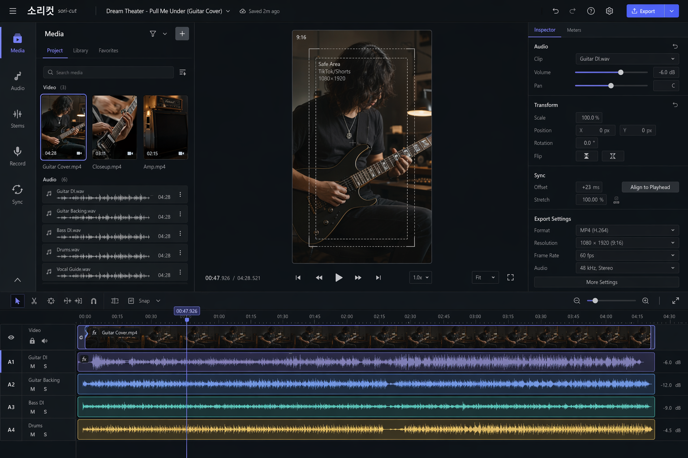
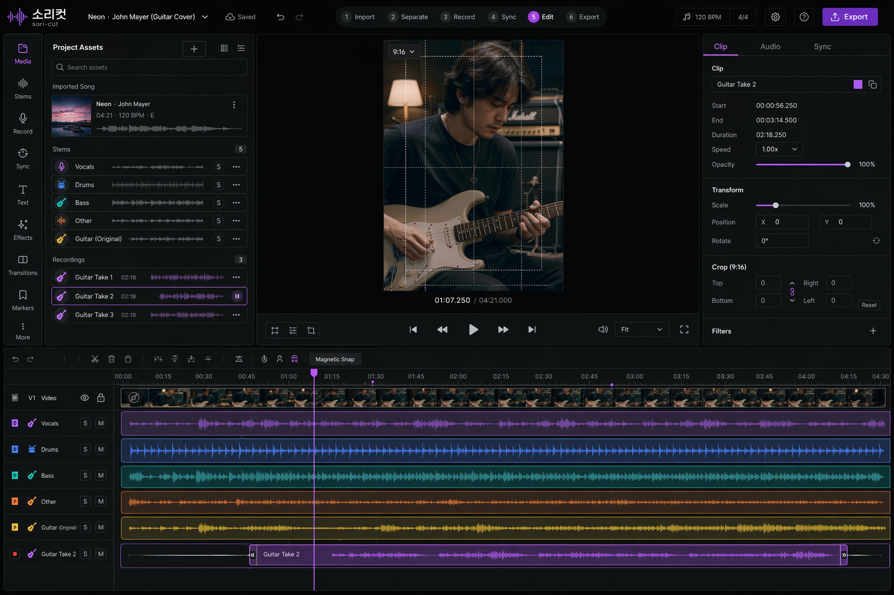
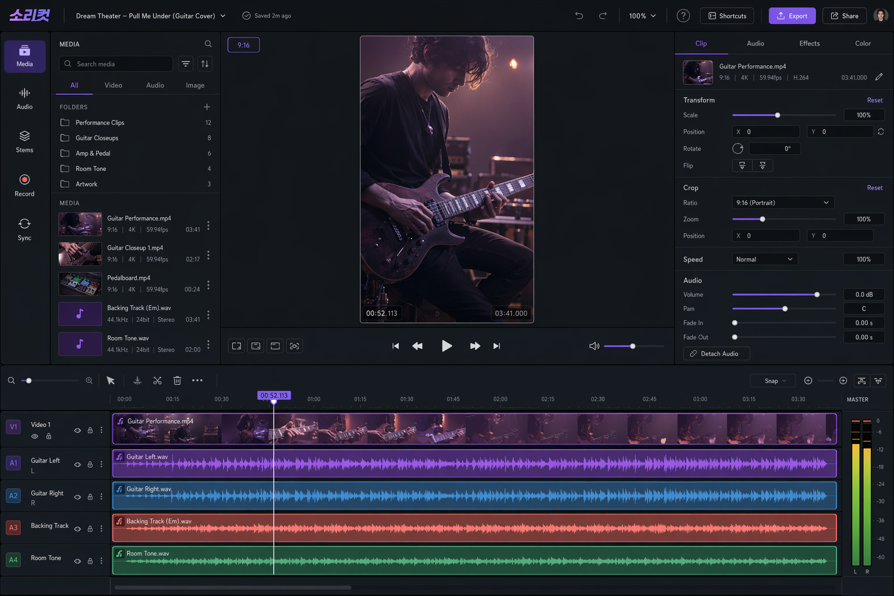

# Studio redesign references

The sori-cut Studio redesign follows a **Fluent-first structure**, combines it
with the **hybrid concept's music workflow**, and uses **selective Bebop
accents** for brand expression.

- [Studio redesign brief](./studio-redesign.md)
- Fluent concept: the primary reference for editor structure and hierarchy
- Hybrid concept: the primary reference for stems, takes, and workflow steps
- Bebop concept: a reference for restrained color and personality

## Fluent concept

## Hybrid concept

## Bebop concept

These are original AI-generated reference images created with the owner's
Azure `gpt-image-2` deployment. They are conceptual direction, not
pixel-perfect implementation requirements.
